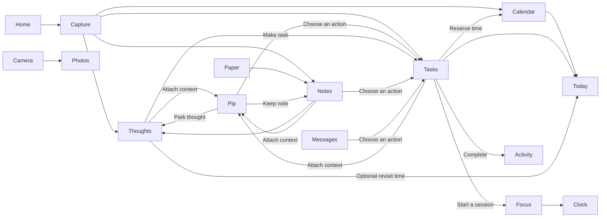

# Pocket: one personal workspace

Pocket replaces the Home screen and gives its apps a shared workflow: **capture → decide → plan → act → review**. Home answers “what matters now?”; it is the starting point for the workspace and communication.

## Each app has a job

| Place | Its purpose | How it connects |
| --- | --- | --- |
| Home | What matters now, communication and quick access | Shows appointments, next action, latest note and Movement readings. Capture, Today, pip and Apps remain reachable. |
| Today | A view of your day | Current/next appointment, overdue and due-today tasks, explicitly chosen next task, ready thoughts and review links. It does not own a second task list. |
| Daily brief | Pip brings the day together | Saved recovery, calendar, chosen or due actions, ready thoughts and gym history on Home/Today. Tap a fact to open it, or ask Pip to prepare a fresh unsent conversation. Works offline; the hide setting syncs. |
| Thoughts | Ideas you have not committed to | Keep, edit, optionally revisit, let go, or explicitly make a task. The task retains the thought and its source note. A revisit time does not create a task or give it a deadline. |
| Tasks | Actions you have chosen | Dates, importance, steps, chosen next action, local reminders, planned time and Focus. Completion appears in Activity. |
| Notes | Context you want to keep | Markdown, pins, drafts, source material and paper transcripts. `>>` captures a thought; “Task” lets you choose an action while keeping the source. Signed-in history and recently deleted recover earlier text. |
| Calendar | Time you reserve | Local appointments and reminders. “Plan time” on a task carries its title and link; the appointment can reopen that exact task. |
| Focus / Clock | Doing something for a set time | Focus uses the task you opened, or Today’s shown appointment. Clock owns the timer, alarms and stopwatch. Starting Focus is explicit. |
| Phone / Messages / Contacts | Communication | Contacts hand off to calls and SMS. Selected messages can become tasks with context. Messenger notifications open their original apps. |
| Camera / Photos | Taking and keeping pictures | Camera’s album opens in Photos; sharing uses Android’s chooser. Photos shows Pocket captures. |
| Paper | Bringing handwriting into the workspace | Keep the original page; optional transcription creates a linked note. Thoughts in the transcript stay undecided. Notes can reopen their original page. |
| pip | Think with the context you choose | The same chat design on phone and web. Attach a Thought, Task or Note, then explicitly keep a reply as a Note, park a Thought or choose a Task. Conversations sync between phone and browser. |
| Activity | Reviewing what you did | The day’s completed tasks and deliberate Pocket actions. Reach it from Today and Settings. |
| Movement | Your physical context | COROS readings appear on Home; tapping a reading opens its detail. |
| Gym | Strength progress | Start a workout, log sets with last time and your best beside them, then read each lift’s estimated best (e1RM) and weekly volume. Synced with the web. |
| Calculator / Dice | Small supporting tools | Reach them under Apps → Extras. They do not become competing organizers. |
| Search | Find an existing record | Notes, Tasks, Thoughts, Paper and Pip share one search on phone and web. Phone appointments and installed apps remain local. Results reopen their record. |
| Settings | App choices and connections | Home selection, custom shortcuts, permissions and one Pocket account across devices. **Set up Pocket** walks through account, phone, COROS and Pip on one ordered page; Today and Home remind until each step is connected or skipped. Passkeys, phone-link codes and revocable device sessions belong here. |

Apps groups communication, planning/thinking, capture/keeping, body and extras. Custom shortcuts and groups remain accessible above those groups. Installed apps remain searchable, so Pocket can be used as the default launcher while keeping needed external apps.

## A complete journey

1. Capture “Maybe spend a weekend in Hamburg” as a **Thought**, with no date or obligation.
2. Keep travel research in a **Note**. A photographed page in **Paper** can supply the same context.
3. When you decide to go, choose **Make task**, then edit the action to “Book the train to Hamburg.” Its source remains available.
4. Give the task a date or choose **Next**. It appears in **Today**. **Plan time** reserves an appointment linked to the task.
5. Start **Focus** from that task, check its steps and complete it. **Activity** records completion; the source thought stays handled.

Back follows the path you took. A saved task opens its details so its next actions are visible. Back from those details returns to the original page. Search is a separate screen, so returning from search restores the unfiltered workspace. Leaving an editor keeps its draft.

## Local and accessible elsewhere

The phone works locally without signing in. A Pocket account syncs the shared workspace through the Astro API and libSQL/Turso; existing phone Drive connections remain selectable. The web has the same **Today / Thoughts / Tasks / Notes** structure and can capture, decide, edit, complete and review those shared records. Source tokens keep one thought linked to its chosen action across phone and web. Handled and deleted records remain as sync markers so older copies do not revive them.

Sign in to the same account on another device. Each passkey is an additional sign-in key for that account; account creation is a separate choice. To connect a phone, approve its short code in a signed-in browser. Password sign-in remains available, and the account screen can revoke other device sessions.

The current shared collections are Thoughts, Tasks, Notes, Paper pages, Activity, Dice lists, Gym workouts, Pip chats, photo zines and COROS readings. Records you explicitly keep from Pip use the existing shared collections. Calendar, timers/reminders, Camera photos, calls, SMS and contacts stay on the phone. The browser uses Vercel-hosted Astro server functions with account-isolated storage. Live device synchronization still needs handset verification. See CLOUD.md for setup and migration.

Pocket is a launcher and a set of native apps running on Nothing OS. Android still owns Recents and system gestures. The current local APK needs the existing release signing key before it can update an installed release.
